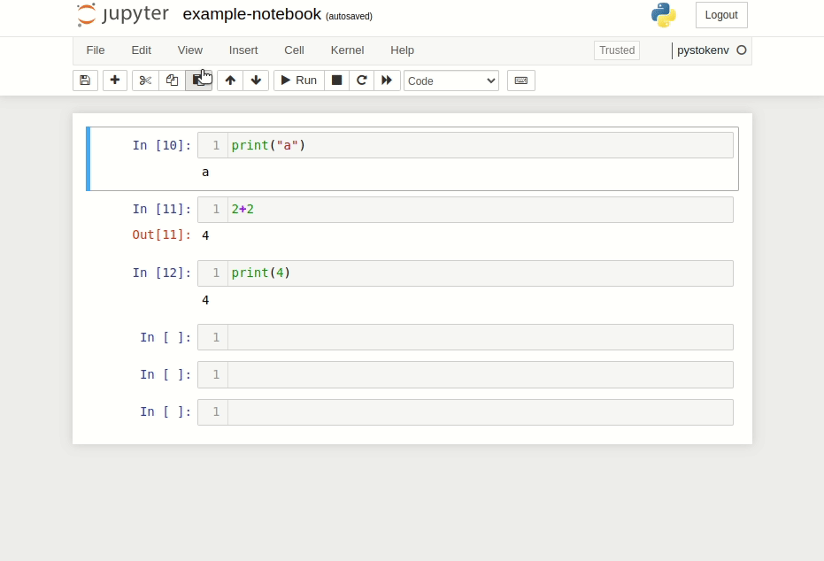

# Exporting Document with `nbconvert`

After data analysis and visualization, you may need to report the results in a familiar format to many people from different teams and easy to share, such as PDF or HTML. One library in Python that can help with this task is [nbconvert](https://nbconvert.readthedocs.io/en/latest/index.html).

Using nbconvert enables:

 >- **presentation** of information in familiar formats, such as PDF.
 >- **publishing** of research using LaTeX and opens the door for embedding notebooks in papers.
 >- **collaboration** with others who may not use the notebook in their work.
 >- **sharing** contents with many people via the web using HTML.

**Contents:**

* TOC
{:toc}


## Installation


### **Step 1**: Prepare your current new environment and activate it

In your Terminal or Command Prompt, type the command:

Windows OS
```
cd [virtual_environmet_name]\Scripts\activate
```
macOS & Linux
```
source [virtual_environmet_name]/bin/activate
```
Make sure you’re in the right directory.
If you using Anaconda/Miniconda/Miniforge environtment, use this command:

```
conda activate <ENV_NAME>
```
> Official Documentation: 
> - [venv](https://packaging.python.org/en/latest/tutorials/installing-packages/#creating-virtual-environments)
> - [conda](https://conda.io/projects/conda/en/latest/user-guide/tasks/manage-environments.html)

### **Step 2**: Installing Nbconvert 

In your Terminal or Command Prompt, type the command:

```
pip install nbconvert
```
OR
```
conda install nbconvert
```

### **Step 3**: Installing Pandoc

For converting markdown to formats other than HTML, nbconvert uses Pandoc (1.12.1 or later). Please go to their [website](https://pandoc.org/installing.html) to download the latest stable release.

Once your download is complete, double click the `.msi` file (Windows OS) or `.pkg` file (macOS) to install it.

### **Step 4**: Installing TeX

For converting notebooks to PDF (with --to pdf), nbconvert makes use of LaTex and the XeTeX as the rendering engine.

*Note: This file download and installation usually takes time due to the its size. Make sure you have sufficient internet connection.*

- macOS (OS X): [MacTeX.](https://tug.org/mactex/)

- Windows: [Latex Project.](https://www.latex-project.org/get/)

For Windows Operation System:

1. Check if your computer meet the [MikTek's prerequisites](https://miktex.org/kb/prerequisites-2-9) 
1. Go to [MikTeX download page](https://miktex.org/download)
2. On Windows sub tab, click 'Download' blue button. It might takes a while to download.
3. Once your download is complete, double click the `.pkg` file to install it.
4. For more installation step-by-step guidance, read the [tutorial](https://miktex.org/howto/install-miktex).
    - **install MiKTeX users only, update auto (not the ask me first)**

Because nbconvert depends on packages and fonts included in standard TeX distributions, if you do not have a complete installation, you may not be able to use nbconvert’s standard tooling to convert notebooks to PDF.


## Using as a command line tool

> *If you wonder why we use command line instead using GUI menu on jupyter notebook, we do this because it offers more flexibility such as we can choose to hide some code, some cell, some output or hide all of them. Of course you can still use the `Download as` menu if you don't need customization.* 

Make sure your command-line prompt already in the ipynb file directory. If not, please follow the steps below.

1. Open File Manager, find the directory of the folder that holds the .ipynb file you want to open
2. Copy the **folder** directory (only up to the folder directory, not the file)
3. Open Command Prompt (Windows) or Terminal (macOS dan Linux)
4. Change directory in Command Prompt with the command `cd` (cd stands for change directory)
   + example: `cd C:\Users\hwulanayu\Documents\`
   + If your directory has spaces, use quotes. example: `cd "C:\Users\hwulanayu\template folder"`
   + Make sure the file storage drive with your Command Prompt base directory is the same. If different, please first change the drive directory by using `cd ..` to backtrack to the root directory. example of changing directory from C to D drive:
   
   ```
   (base) C:\Users\hwulanayu> cd ..
   (base) C:\Users>cd ..
   (base) C:\>cd D:
   (base) D:\> cd D:\Users\hwulanayu\Documents`
   ```
   
---

### Run the `nbconvert`

The command-line syntax to run the `nbconvert` script is:

<p style="font-family:'Courier New';color:red;font-size:15px"><b>jupyter nbconvert &lt;FILE_NAME&gt;.ipynb --to &lt;FORMAT&gt;</b></p>

This will convert the Jupyter notebook file `notebook.ipynb` into the output format given by the `FORMAT` string.

### Supported output formats

Many formats are [supported by nbconvert](https://nbconvert.readthedocs.io/en/latest/usage.html#supported-output-formats), such as Markdown, LaTex, executable scripts, and others. However, the formats we will discuss in this documentation are **HTML and PDF.**

### IPYNB to HTML format file


- **`--to html`**

    HTML Export. Note on backward compatibility: Be aware that if you were using custom copies of the old 5.x template files (i.e. --template), you will now need to use --template-file path/to/old/file.tpl in order to use that file in compatibility mode as opposed to other options.


- **`--template lab (default)`**
  
  A full static HTML render of the notebook. This looks very similar to the JupyterLab interactive view.

    The lab template supports the extra --theme option, which defaults to light. This extra option not only allows you to use the default light or dark themes provided by JupyterLab, but it allows you to use custom themes. For example:

    ```
    pip install jupyterlab-miami-nights then --theme jupyterlab_miami_nights.
    ```

- **`--template classic`**

    Simplified HTML, using the classic jupyter look and feel.


- **`--template basic`**
    
    Base HTML, rendering with minimal structure and styles.


- **`--embed-images`**

    If this option is provided, embed images as base64 urls in the resulting HTML file.


> Official Documentation: [html format](https://nbconvert.readthedocs.io/en/latest/usage.html#html)

### IPYNB to PDF


- **`--to pdf`**
    
    Generates a PDF via latex. Supports the same templates as `--to latex`.


- **`--template article`**  (default)

    Latex article, derived from Sphinx’s howto template.


- **`--template-file report`**

    Latex report, providing a table of contents and chapters.


Optionally you can specify authors, title and date in the notebook’s metadata. These will be used to render the header of the LaTeX document.

```
{
    "authors": [
        {
            "name": "Jane Doe"
        },
        {
            "name": "John Doe"
        }
    ],
    "date": "May 2023",
    "title": "Q1 Data Report 2023",
    "kernelspec": { },
    "language_info": { }
}

```

If no date is specified, today’s date will be used (i.e. the date when the document is re/compiled). Use an empty string to suppress the date.

The values in the notebook can be overridden by the command line arguments `--LatexPreprocessor.title`, `--LatexPreprocessor.date` and `--LatexPreprocessor.author_names` (specify this argument multiple times for each individual author name).

Example:
```
jupyter nbconvert <FILE_NAME>.ipynb --to <FORMAT> 
--LatexPreprocessor.title <"YOUR_FILE_TITLE">
```

#### Custom template default with LaTex

Alternatively, if you still want to use the default article template but want to add a table of contents or other customizations, you can use the LaTeX syntax. Notebooks that contain LaTeX syntax can use the command `--TemplateExporter.exclude_input=True` to [remove LaTeX syntax in the PDF output.](https://nbconvert.readthedocs.io/en/latest/config_options.html#configuration-options) 

Example of [LaTeX syntax](http://www.utc.fr/~jlaforet/Suppl/latex-cheatsheet.pdf) with `%%` magic command from [IPython kernel](https://ipython.readthedocs.io/en/stable/interactive/magics.html):
```
%%latex
\newpage

%%latex
\tableofcontents

%%latex
\hfill
```

*Note: you might want to remove input cell with tags if you use latex syntax.*

### CLI Flags 

When using Nbconvert from the command line, a number of aliases and flags are defined as shortcuts to configuration options for convience.

The following flags are defined:

- **```--no-prompt```**

    Exclude input and output prompts from converted document.


- **```--no-input```**

    Exclude input cells and output prompts from converted document. This mode is ideal for generating code-free reports.


- **```--embed-images```**

    Embed the images as base64 dataurls in the output. This flag is only useful for the HTML/WebPDF/Slides exports.


- **```--clear-output```**

    Clear output of current file and save in place, overwriting the existing notebook.


- **```--execute```**

    Execute the notebook prior to export.


- **```--allow-errors```**

    Continue notebook execution even if one of the cells throws an error and include the error message in the cell output (the default behaviour is to abort conversion). This flag is only relevant if ‘–execute’ was specified, too.


- **```--output```**
     
     Change the name of the converted file. Write output name without the file extension.


- **```--output-dir```**
     
     Change the directory of the converted file.
     

- **```--debug```**
     
     set log level to logging.DEBUG (maximize logging output)


- **```--show-config```**

    Show the application’s configuration (human-readable format)


- **```--generate-config```**

    generate default config file


- **```--y```**

    Answer yes to any questions instead of prompting.


- **```--stdin```**

    read a single notebook file from stdin. Write the resulting notebook with default basename ‘notebook.*’


- **```--stdout```**

    Write notebook output to stdout instead of files.


> for more CLI flags, see the **[Official Documentation](https://nbconvert.readthedocs.io/en/latest/config_options.html#cli-flags-and-aliases)**

## Converting multiple notebooks

Multiple notebooks can be specified from the command line:

```
jupyter nbconvert notebook*.ipynb

jupyter nbconvert notebook1.ipynb notebook2.ipynb
```

or via a list in a [configuration file](https://nbconvert.readthedocs.io/en/latest/usage.html#converting-multiple-notebooks).

## Merge multiple notebooks

This code can be applied on command line prompt or jupyter notebook. If you doing it on CLI, activate Python first with `python` command.
example:
```
(base) hwulanayu@MacBook-Air ~ % python
Python 3.9.16 (main, Mar  8 2023, 04:29:24) 
[Clang 14.0.6 ] :: Anaconda, Inc. on darwin
Type "help", "copyright", "credits" or "license" for more information.
>>> 
```
Either on CLI or jupyter notebook, make sure `import nbformat` first.

### Reading the notebooks

The official Jupyter Notebook format is defined with [this JSON schema](https://github.com/jupyter/nbformat/blob/main/nbformat/v4/nbformat.v4.schema.json), which is used by Jupyter tools to validate notebooks. `.read()` function of nbconvert, reads the notebook in JSON format.

> Official Documentation: [*notebook file format.*](https://nbformat.readthedocs.io/en/latest/format_description.html)

```python
import nbformat

first_notebook = nbformat.read("example_file_1.ipynb", as_version=4)
second_notebook = nbformat.read("example_file_2.ipynb", as_version=4)
third_notebook = nbformat.read("example_file_3.ipynb", as_version=4)
```

### Create new merged notebook

Create a new notebook that will have the merged contents of the above three notebooks. We copy the first notebook JSON metadata on version 4.

```python
final_notebook = nbformat.v4.new_notebook(metadata=first_notebook.metadata)
```

### Concat the notebooks

concat all the cell values.

```python
final_notebook.cells =  first_notebook.cells + second_notebook.cells + third_notebook.cells
```

### Saving the notebook

```python
nbformat.write(final_notebook, 'final_notebook.ipynb')
```

> Official Documentation: [*nbconvert API*](https://nbformat.readthedocs.io/en/latest/api.html)

## Removing cells, inputs, or outputs

When converting Notebooks into other formats, it is possible to remove or hide parts of a cell, or entire cells, using preprocessors. The notebook will remain unchanged, but the outputs will have certain pieces removed. Here are two primary ways to accomplish this.

The most straightforward way to control which pieces of cells are removed is to use **cell tags**. These are single-string snippets of metadata that are stored in each cells “tag” field. The `TagRemovePreprocessor` can be used to remove inputs, outputs, or entire cells.

You can add tag for cell that has code that you would like to hide or remove. 
Add tags to a cell:

1. Click **View** Menu on top of your jupyter notebook
2. Click **Cell Toolbar**
3. Choose **Tags**
4. Now, all your your code cells have tags toolbar. Add a tag `hide_cell`, or `remove_cell`, or `hilangkan` (it can be any string) to the selected cell. 

The animation below from [Aleksandra Płońska and Piotr Płoński](https://mljar.com/blog/jupyter-notebook-hide-code/) shows how it can be done:

<p align="center" width="100%">
    
</p>

To return the cell code without the Tags toolbar, click **View > Cell Toolbar > choose None.**


Below are the command-line syntax using the CLI to remove cells, input, and output cells with a certain cell tag:


### Remove cells

```
jupyter nbconvert <FILE_NAME>.ipynb --to <FORMAT> 
--TagRemovePreprocessor.remove_cell_tags <REMOVE_CELL_TAG>
```

### Remove input code cells 

```
jupyter nbconvert <FILE_NAME>.ipynb --to <FORMAT> 
--TagRemovePreprocessor.remove_input_tags <REMOVE_INPUT_TAG>
```

### Remove output cells

```
jupyter nbconvert <FILE_NAME>.ipynb --to <FORMAT> 
--TagRemovePreprocessor.remove_all_outputs_tags <REMOVE_OUTPUT_TAG>
```


This additional example demonstrates using the CLI to combine remove cells and hide input code cells with a certain cell tag:
    
```
jupyter nbconvert mynotebook.ipynb --TagRemovePreprocessor.remove_cell_tags remove_cell 
--TagRemovePreprocessor.remove_input_tags --remove_input_cell
```

# Handling Installation Errors


- Make sure the installed Python version is supported by nbconvert. When writing this documentation, nbconvert only supports up to Python version 3.9. [see official documentation](https://nbconvert.readthedocs.io/en/latest/install.html#supported-python-versions)
- Try to reinstall MikTeX. Make sure you remove these folder on:
    + `C:\Users\<name>\AppData\Local\Programs\MiKTeX`
    + `C:\Users\<name>\AppData\MiKTeX`
    + `C:\Program Files\MiKTeX`
    + or you can follow this instruction (Windows OS): https://miktex.org/faq/uninstall-miktex-win-cli
- install MiKTeX users only, update **auto** (not the `ask me first`)
- pastikan pandoc terinstall
- make sure the MikTeX, TinyTeX, and Pandoc PATH already exists in the system variables path
- try again jupyter nbconvert xxx.ipynb --to pdf

## error 1

```
(env) C:\Users\hwulanayu\env\Scripts>jupyter notebook

error: Microsoft Visual C++ 14.0 or greater is required. Get it with "Microsoft C++ Build Tools": https://visualstudio.microsoft.com/visual-cpp-build-tools/
      [end of output]
  note: This error originates from a subprocess, and is likely not a problem with pip.
  ERROR: Failed building wheel for pysqlite3
Failed to build pysqlite3
ERROR: Could not build wheels for pysqlite3, which is required to install pyproject.toml-based projects
```

**Solved by: installing the C++ build tools**

## error 2

*If you happen to use sqlite library on your jupyter notebook.*
```
(env) C:\Users\hwulanayu\env\Scripts>jupyter notebook

Traceback (most recent call last):
  File "C:\Users\hwulanayu\anaconda3\lib\runpy.py", line 197, in _run_module_as_main
    return _run_code(code, main_globals, None,
  File "C:\Users\hwulanayu\anaconda3\lib\runpy.py", line 87, in _run_code
    exec(code, run_globals)
  File "C:\Users\hwulanayu\env\Scripts\jupyter-notebook.EXE\__main__.py", line 4, in <module>
  File "C:\Users\hwulanayu\env\lib\site-packages\notebook\notebookapp.py", line 83, in <module>
    from .services.sessions.sessionmanager import SessionManager
  File "C:\Users\hwulanayu\env\lib\site-packages\notebook\services\sessions\sessionmanager.py", line 12, in <module>
    from pysqlite2 import dbapi2 as sqlite3
ModuleNotFoundError: No module named 'pysqlite2'
```

**Solved by: Copy C:\ProgramData\Anaconda3\Library\bin\sqlite3.dll to C:\ProgramData\Anaconda3\DLLs\sqlite3.dll OR
find sqlite3.dll in window search. Open the file location. Copy the file to the DLL folder.**

## error 3

```
(env) C:\Users\hwulanayu\env\Scripts>jupyter nbconvert markdown_text_formatting.ipynb --to html

    preprocessor_cls = import_item(preprocessor)
  File "C:\Users\hwulanayu\env\lib\site-packages\traitlets\utils\importstring.py", line 30, in import_item
    module = __import__(package, fromlist=[obj])
ModuleNotFoundError: No module named 'jupyter_contrib_nbextensions'
```
**Solved by: pip install jupyter_contrib_nbextensions**

## error 4

```
(env) C:\Users\hwulanayu\Documents\handbook>jupyter nbconvert Working_with_SQL_Database.ipynb --to html

  File "C:\Users\hwulanayu\env\lib\site-packages\mistune\block_parser.py", line 291, in _iter_render
    yield method(children, *params)
  File "C:\Users\hwulanayu\env\lib\site-packages\nbconvert\filters\markdown_mistune.py", line 181, in block_code
    lang = info.strip().split(None, 1)[0]
IndexError: list index out of range
```

**Solved by: specified the language after the \`\`\` in one of my code blocks.. Ref https://github.com/jupyter/nbconvert/issues/1505**

## References

- [`nbconvert` Official Documentation](https://nbconvert.readthedocs.io/en/latest/)
- [Pandoc Official Documentation](https://pandoc.org/)
- [MikTeX Official Documentation](https://miktex.org/)
- Aleksandra Płońska, Piotr Płoński, ["How to hide code in Jupyter Notebook?"](https://mljar.com/blog/jupyter-notebook-hide-code/)
- Satyam Kumar, [Merge multiple Jupyter Notebooks together with Python](https://towardsdatascience.com/merge-multiple-jupyter-notebooks-together-with-python-1696eb8d0dab)
